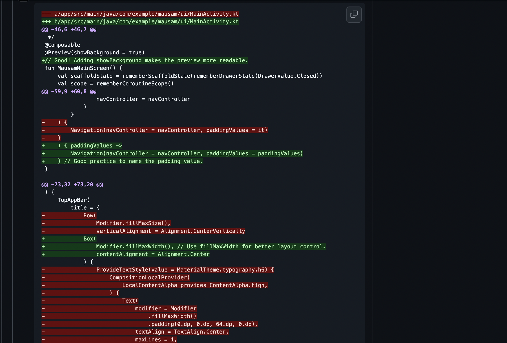
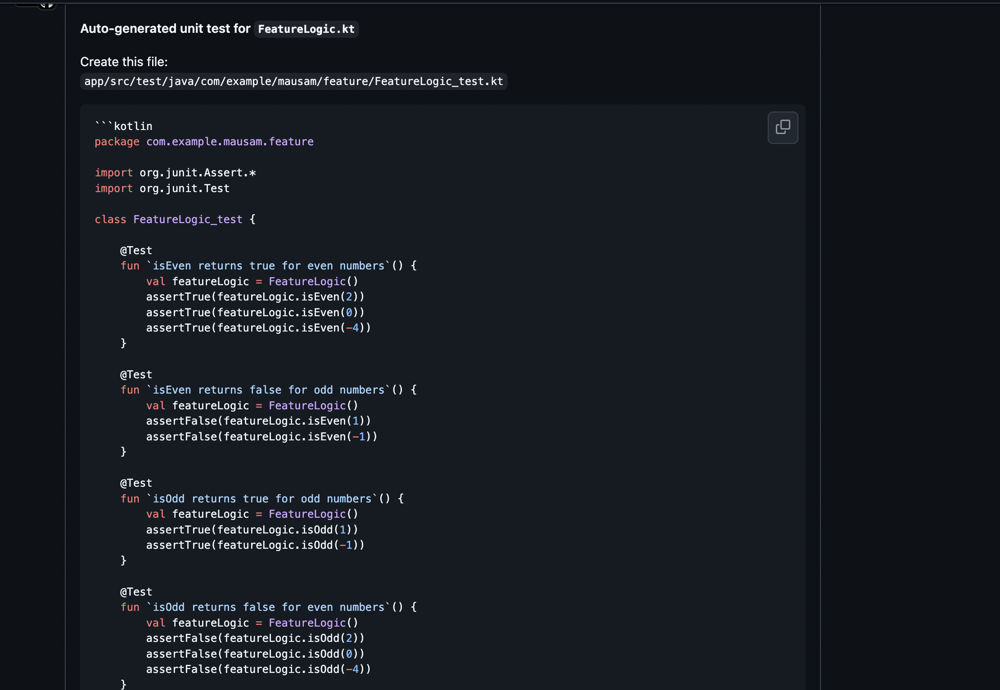

# AI Code Review Bot

This repository contains a GitHub Actions script for automated AI-powered code review using Gemini and the GitHub API.

## Features
- Fetches changed files in a pull request
- Uses Gemini to generate actionable inline review comments
- Posts comments directly to the pull request
- Can generate comments on test coverage
- Debug logging for troubleshooting

## Example: AI Review Inline Comment

Below is a screenshot showing how the AI Code Review workflow leaves inline comments on a pull request:



## Example: Test Suggestions

Below is a screenshot showing how the workflow suggests tests for your code changes:



## How It Works
1. **Environment Variables**: The script loads required secrets and configuration from environment variables (see below).
2. **Changed Files Detection**: It fetches the list of changed files in the current pull request.
3. **AI Review Generation**: For each file diff, Gemini is called to generate a review comment, which is cleaned and truncated for GitHub.
4. **Comment Posting**: The script posts inline review comments and optional PR-level comments.
5. **Test Coverage Comments**: Optionally, it can analyze and comment on the presence or absence of test coverage for a file.

## Environment Variables
Set these in your GitHub Actions workflow:
- `GITHUB_TOKEN`: GitHub token with repo access
- `GITHUB_REPOSITORY`: Repository in `owner/repo` format
- `GITHUB_REF`: GitHub ref for the PR (e.g., `refs/pull/123/head`)
- `GEMINI_API_KEY`: API key for Gemini

## Main Functions (ai_code_review.py)
- `get_changed_files()`: Returns a list of files changed in the PR.
- `generate_review_comment(diff_hunk, filename)`: Uses Gemini to generate a review comment for a code diff.
- `post_inline_comment(body, path, position)`: Posts an inline comment to GitHub.
- `generate_test_coverage_comment(source_code, test_code, ...)`: Analyzes and comments on test coverage.
- `fetch_file_content(repo, path)`: Fetches file content from GitHub.
- `infer_source_filename(test_filename)`: Infers a source file from a test filename.
- `main()`: Orchestrates the review process.
- `debug_log(msg)`: Prints debug messages if `DEBUG` is set to `True`.

## Getting Started

### Prerequisites
- Python 3.7+
- Required environment variables (see above)

### Usage
1. Place `ai_code_review.py` in your workflow/scripts directory (e.g., `.github/scripts/`).
2. Add a step to your GitHub Actions workflow to run the script as part of your PR review pipeline.

Example workflow step:
```yaml
- name: Run AI Code Review
  run: python .github/scripts/ai_code_review.py
  env:
    GITHUB_TOKEN: ${{ secrets.GITHUB_TOKEN }}
    GITHUB_REPOSITORY: ${{ github.repository }}
    GITHUB_REF: ${{ github.ref }}
    GEMINI_API_KEY: ${{ secrets.GEMINI_API_KEY }}
```

## Customization
- Modify the review prompt in `generate_review_comment()` to fit your code review guidelines.
- Set the `DEBUG` flag to `True` or `False` for verbose logging.

## File Structure
- `.github/scripts/ai_code_review.py`: Main script for code review automation
- `README.md`: Project documentation

## License
MIT
